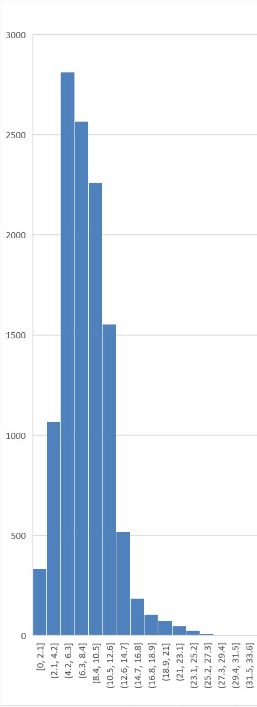
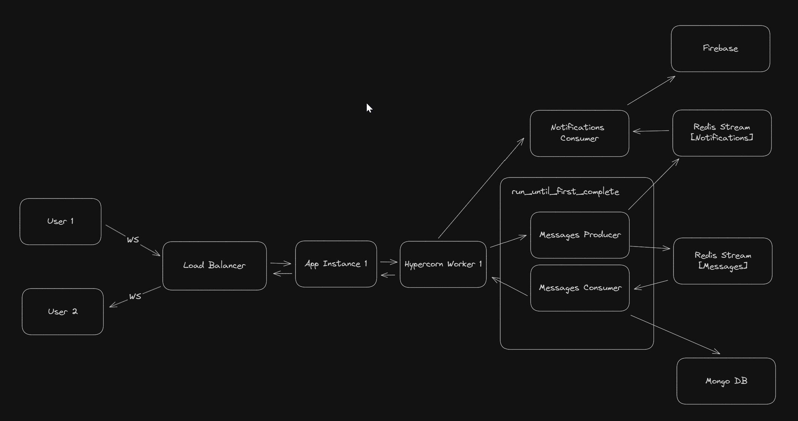

# Scalable chat server

Scaling is achieved by using the Redis Stream mechanism.

It helps store websocket connections in redis memory
and distribute is through different application replicas.

So the **bottleneck** of the system is Redis.

**Performance indicators** (estimated with **1 uvicorn worker**):
> RPS - requests (messages) per seconds (mean)  
> TTR, ms - time to response (mean)
- 200 RPS = 5 TTR



**Dependencies:**
- python 3.1*
- FastAPI
- asyncio
- Redis
- MongoDB
- Firebase
- Docker
- docker-compose
- hypercorn



**Run:** 
```shell
docker-compose up -d
```